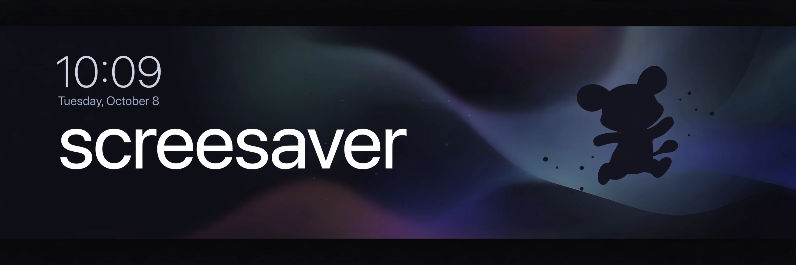

# screesaver

> ## Status: 🟢 Completed
>
> <progress value="95" max="100"></progress>
> **Progress: 95%** — The full lockscreen sequence, all 4 entrance variants, unlock/re-lock flow, and reduced-motion support all work; remaining 5% is extra variants and polish.

<p align="center">
  
</p>

## What it is

A fullscreen **Mac lockscreen animation collection** built as a zero-dependency web page — one `index.html`, one CSS file, one JS file. The background fades in first, then a character cutout enters through one of **4 animation variants** (Drift In, Rise, Materialize, Arc), the clock and date stagger in, and clicking or pressing any key "unlocks" into a mock desktop. It's a fullscreen simulation (macOS won't let a web page replace the real lock screen) — convincing enough to demo, record, or project.

## What works (verified)

- ✅ Background fade-in with slow settle — `index.html` + `css/style.css`, served locally, all assets return 200
- ✅ 4 character entrance variants — verified `VARIANTS = ["drift","rise","materialize","arc"]` in `js/app.js`, variant buttons in the pill bar
- ✅ Clock + date stagger in — `#clock` / `#time` / `#date` elements wired in `js/app.js`
- ✅ Unlock flow — click or any key exits the stage (≤300ms ease-in) into the mock desktop; verified handler in `app.js`
- ✅ Re-lock — `Escape` (or the "Lock again" pill) returns to the lockscreen; verified `e.key === "Escape"` → `lock()`
- ✅ Keys `1–4` switch variants, `R` replays — verified key handlers in `js/app.js`
- ✅ Idle float + mouse parallax — present in `app.js`/`style.css`
- ✅ `prefers-reduced-motion` respected — everything jumps to final state
- ✅ No TODOs, FIXMEs, or stub code anywhere in the repo

## Tech stack

| Layer | Tech |
|---|---|
| Markup | HTML5 (`index.html`) |
| Styling / animation | Vanilla CSS keyframes + cubic-bezier easings (`css/style.css`, 341 lines) |
| Logic | Vanilla JS, no frameworks (`js/app.js`, 146 lines) |
| Assets | PNG cutouts (`assets/background.png`, `assets/person.png`) |
| Motion method | Disney's 12 principles of animation (anticipation, arcs, squash, stagger, slow in/out) |

## How to run

```bash
cd screesaver
python3 -m http.server 8123
# → http://localhost:8123  (then fullscreen the browser: ⌃⌘F on Mac)
```

Easiest alternative: double-click `index.html` and fullscreen the browser. Tested: `python3 -m http.server` serves `index.html`, `css/style.css`, `js/app.js`, and both PNG assets — all return HTTP 200.

**Controls:** click / any key = unlock · `1–4` = switch variant · `R` = replay · `Esc` = re-lock.

## Screenshots

No screenshots are checked into the repo — the banner above is the visual. (It's a fullscreen animation piece; the best "screenshot" is opening `index.html` and pressing `1–4`.)

## What you can add more

- [ ] More entrance variants (e.g. glitch-in, slide-from-edge, particle dissolve) — the `VARIANTS` array + CSS class pattern makes adding one trivial
- [ ] A real photo/upload slot so anyone can drop in their own character cutout
- [ ] Sound design — subtle whoosh on entrance, click on unlock (WebAudio, no assets needed)
- [ ] Time-of-day backgrounds — swap `background.png` based on the actual clock
- [ ] Record-mode — a query param (`?autoplay&variant=arc`) for clean screen recordings

## Project structure

```
screesaver/
├── index.html          # lockscreen stage, clock, variant bar, mock desktop
├── css/style.css       # all keyframes, easings, z-index layers (341 lines)
├── js/app.js           # sequencing, clock, parallax, unlock/lock (146 lines)
├── assets/
│   ├── background.png  # the classroom backdrop
│   └── person.png      # the character (alpha cutout)
└── banner.webp         # project banner
```

---
*README written after code audit on 2026-10-08.*
